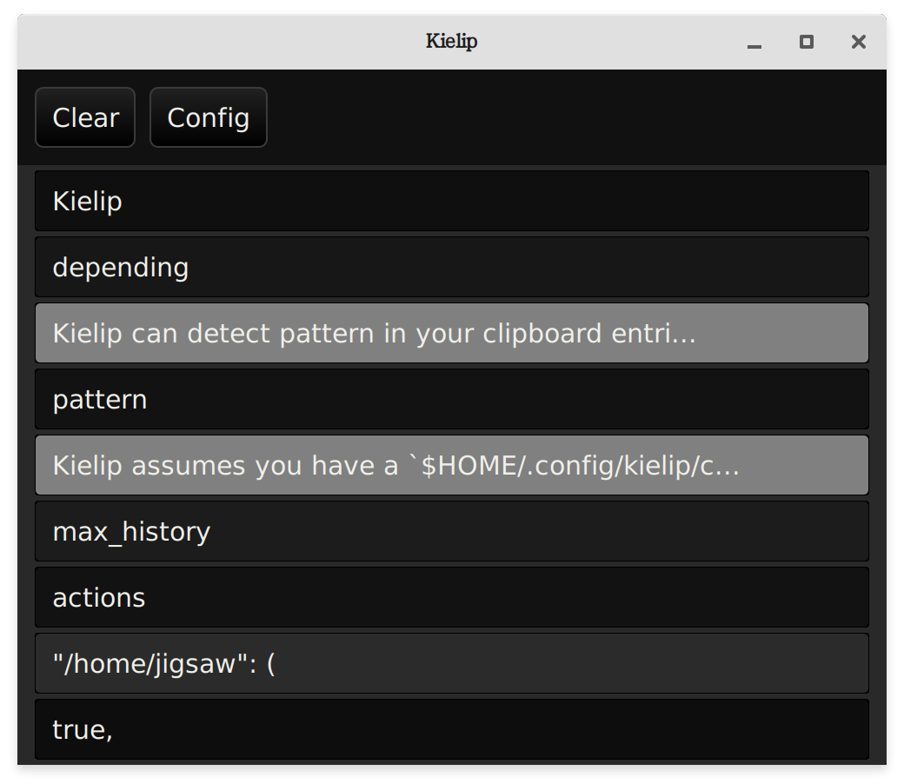

# Kielip: a clipboard manager



Kielip is a clipboard manager written in rust, using the druid gui toolkit. At the moment only tested on Linux. This software is release under the BSD license, use at your own risk.

## Regex matching and taking action on the fly

Kielip can detect pattern in your clipboard entries and take some actions on the fly. Right now there are 3 kinds of actions (depending on your configuration):

- **Remove** the matched text
- **Scramble** the matched text, i.e. replace it with some randome string
- **Exec** some command based on the entry when the entry is matched

## Configuration

Kielip assumes you have a `$HOME/.config/kielip/config.ron` file on your system. If not, a default config will be used, which means no actions will be taken.

Example config file:

```
(
    max_history: 50,
    actions: {
        "/home/jigsaw": (
            false,
            Scramble,
        ),
        "/home/bignaw": (
            false,
            Scramble,
        ),
        "https://.*": (
            true,
            Exec(
                command_pattern: "firefox -private-window {}",
            ),
        ),
    },
)
```

The boolean in the tuple determines if the action is active or not. Intuitively, only active actions are effective.
